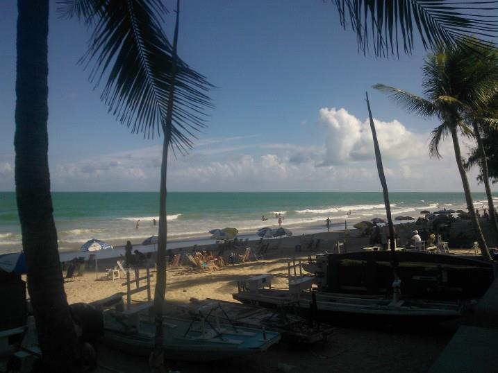
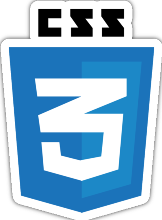

  

    
  

  <h1 align="left" style="color:green;">Hi , I'm Arlesson Moura a Full Stack developer.
  </h1>
  

  
I am from Brazil, based in the city of Recife

     
    

      Beyond being a stunning place to live, rich in history, and home to one of the most delicious cuisines in Brazil, Recife is also the country's largest technology hub.
    

    

      
      
      
      
    

  

  

    I hold a degree in Economics and have an MBA in Project Management. Since December 2020, I have been actively learning software development. I am a professional with front-end experience in JavaScript/TypeScript, Angular and React; I am well-versed in Agile Methodologies. Additionally, I have received full-stack training, covering React/Angular, JavaScript, Node, Docker, NX, PHP, Laravel, PostgreSQL, MySQL, MongoDB, and Unit/Integration Testing.
     
    I emphasize my extensive familiarity with teamwork, always using empathy to understand and validate the feelings and ambitions of my team.
  

  <h3 align="left">Languages and Tools:</h3>
  

    
    
    
    
    
    
    
    
    
    
    
    
    
    
    
    
    
    
    
  

  <a href="https://github.com/ArlessonMoura">
  
  

<picture>
  <source media="(prefers-color-scheme: dark)" srcset="https://raw.githubusercontent.com/ArlessonMoura/ArlessonMoura/output/github-contribution-grid-snake-dark.svg">
  <source media="(prefers-color-scheme: light)" srcset="https://raw.githubusercontent.com/ArlessonMoura/ArlessonMoura/output/github-contribution-grid-snake.svg">
  
</picture>

  
  

    
    <h3 align="center">
    Contact me:
    </h3>
  

  
  

    
    
    
  

###

